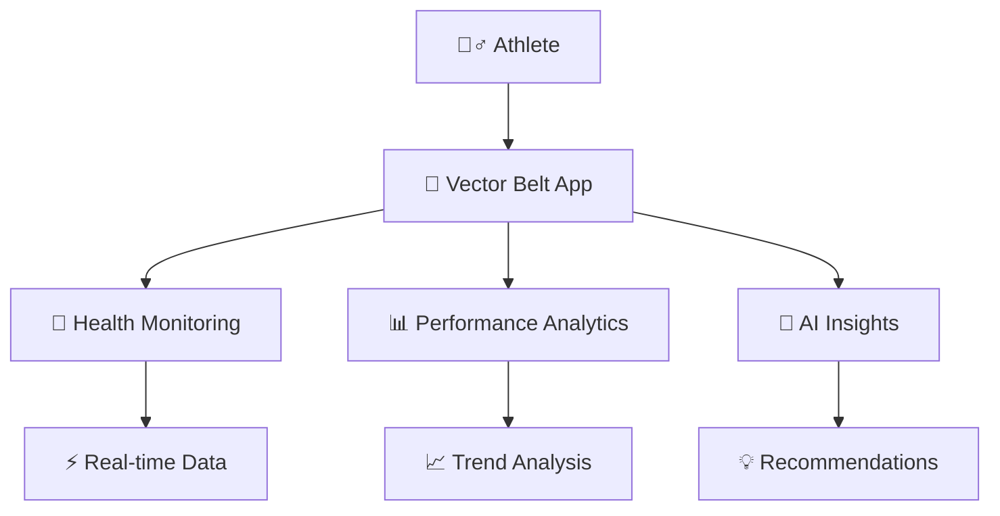

<div align="center">

# 🏃‍♂️ Vector Belt
## *Athlete Health Monitoring Mobile App*

[](https://flutter.dev/)
[](https://dart.dev/)
[](https://flutter.dev/multi-platform)


*Revolutionizing athlete health monitoring with real-time data, AI insights, and comprehensive wellness tracking*


</div>

---

## 🎯 About the Project

<table>
<tr>
<td width="60%">

**Vector Belt** is a next-generation athlete health monitoring application that transforms how sports professionals track and optimize their performance. Built with cutting-edge Flutter technology, it delivers real-time biometric analysis, predictive health insights, and seamless device integration.

### 🚀 **Key Highlights:**
- 📊 **Real-time EMG monitoring** for muscle performance
- 🧠 **AI-powered health predictions** and recommendations  
- 🔗 **Multi-device synchronization** with wearables
- 📱 **Cross-platform compatibility** across all devices
- 🎨 **Intuitive Material Design 3** interface

</td>
<td width="40%">



</td>
</tr>
</table>

## ✨ Features & Capabilities

<div align="center">

### 🏆 **Core Functionality**

</div>

| Feature | Description | Status |
|---------|-------------|--------|
| 💓 **Real-time Health Monitoring** | Live tracking of vital signs and health metrics | ✅ Active |
| ⚡ **EMG Dashboard** | Advanced electromyography data visualization | ✅ Active |
| 🧠 **AI-Powered Insights** | Machine learning health recommendations | 🚧 Development |
| 🏃‍♂️ **Performance Tracking** | Comprehensive athletic performance monitoring | ✅ Active |
| 📱 **Device Management** | Multi-device connectivity and synchronization | ✅ Active |
| 📅 **Smart Calendar** | Training schedules and health appointments | ✅ Active |
| 💬 **Secure Messaging** | Encrypted communication with healthcare providers | 🚧 Development |

<div align="center">

### 🎨 **User Experience Excellence**

</div>

<table>
<tr>
<td align="center" width="25%">
  
  <br><b>Modern UI/UX</b>
  <br><small>Material Design 3</small>
</td>
<td align="center" width="25%">
  
  <br><b>Adaptive Themes</b>
  <br><small>Light & Dark Modes</small>
</td>
<td align="center" width="25%">
  
  <br><b>Cross-Platform</b>
  <br><small>iOS, Android, Web, Desktop</small>
</td>
<td align="center" width="25%">
  
  <br><b>Responsive</b>
  <br><small>All Screen Sizes</small>
</td>
</tr>
</table>

## 🏗️ Architecture

### Technology Stack
- **Frontend**: Flutter (Dart)
- **State Management**: Provider pattern
- **UI Framework**: Material Design 3
- **Supported Platforms**: Android, iOS, Web, Windows, macOS, Linux

### Project Structure
```
lib/
├── main.dart                 # App entry point
├── providers/               # State management
│   ├── navigation_provider.dart
│   └── theme_provider.dart
├── screens/                 # App screens
│   ├── landing_page.dart
│   ├── login_page.dart
│   ├── signup_page.dart
│   ├── dashboard_page.dart
│   ├── wellness_page.dart
│   ├── messages_page.dart
│   ├── calendar_page.dart
│   └── devices_page.dart
└── widgets/                 # Reusable components
    ├── main_navigation.dart
    ├── theme_toggle.dart
    └── dashboard/
        ├── ai_insights.dart
        ├── emg_dashboard.dart
        ├── kpi_cards.dart
        └── performance_charts.dart
```

## 🚀 Quick Start Guide

<div align="center">

### 📋 **Prerequisites Checklist**

</div>

| Tool | Version | Status | Download |
|------|---------|--------|----------|
| 🔵 Flutter SDK | 3.9.2+ | Required | [Download](https://flutter.dev/docs/get-started/install) |
| 🎯 Dart SDK | 3.0+ | Included | [Info](https://dart.dev/get-dart) |
| 💻 IDE | Latest | Required | [Android Studio](https://developer.android.com/studio) / [VS Code](https://code.visualstudio.com/) |
| 🔧 Git | Latest | Required | [Download](https://git-scm.com/) |

<div align="center">

### 📦 **Installation Steps**

</div>

```bash
# 🔗 Step 1: Clone the repository
git clone https://github.com/Imdad2005/vector-mobile-app.git
cd vector_mobile_app

# 📱 Step 2: Install dependencies
flutter pub get

# 🚀 Step 3: Run the application
flutter run
```

<div align="center">

**🎉 That's it! Your Vector Belt app is now running!**

</div>

### Development Setup

1. **Enable developer options** on your device
2. **Configure your IDE** with Flutter and Dart plugins
3. **Set up emulators** for testing across different devices

## 📖 How to Use Vector Belt

<div align="center">

### 🔐 **Authentication **

</div>

> 🚨 **Currently in Prototyping Mode** - For testing purposes only

```
📧 Email: Any valid email (must contain "@")
🔑 Password: Any non-empty password
✅ Result: Automatic login → Dashboard access
```

<div align="center">

### 🧭 **App Navigation**

</div>

<table>
<tr>
<td align="center" width="20%">
  
  <br><b>📊 Dashboard</b>
  <br><small>Health Overview</small>
</td>
<td align="center" width="20%">
  
  <br><b>🏃‍♂️ Wellness</b>
  <br><small>Fitness Tracking</small>
</td>
<td align="center" width="20%">
  
  <br><b>💬 Messages</b>
  <br><small>Communication</small>
</td>
<td align="center" width="20%">
  
  <br><b>📅 Calendar</b>
  <br><small>Scheduling</small>
</td>
<td align="center" width="20%">
  
  <br><b>📱 Devices</b>
  <br><small>Device Management</small>
</td>
</tr>
</table>

## 🛠️ Development

### Key Dependencies
```yaml
dependencies:
  flutter: sdk
  provider: ^6.1.5+1      # State management
  flutter_svg: ^2.2.1     # SVG support
  animations: ^2.0.11     # Enhanced animations
  cupertino_icons: ^1.0.8 # iOS-style icons
```

### Build Commands
```bash
# Debug build
flutter run

# Release build (Android)
flutter build apk --release

# Release build (iOS)
flutter build ios --release

# Web build
flutter build web
```

## 🎨 Design System

The app implements a comprehensive design system with:
- **Material Design 3** components
- **Adaptive color schemes** for light/dark modes
- **Consistent typography** and spacing
- **Responsive layouts** for different screen sizes

## 🧪 Testing

### Running Tests
```bash
# Run all tests
flutter test

# Run tests with coverage
flutter test --coverage
```

### Widget Testing
The project includes widget tests for core functionality. Test files are located in the `test/` directory.

## 📱 Platform Compatibility Matrix

<div align="center">

| Platform | Status | Minimum Version | Testing Status |
|----------|--------|-----------------|----------------|
| 🤖 **Android** | ✅ **Supported** | API 21+ (Android 5.0) | 🧪 **Tested** |
| 🍎 **iOS** | ✅ **Supported** | iOS 12+ | 🧪 **Tested** |
| 🌐 **Web** | ✅ **Supported** | Modern Browsers | 🧪 **Tested** |
| 🪟 **Windows** | ✅ **Supported** | Windows 10+ | 🔄 **In Progress** |
| 🍎 **macOS** | ✅ **Supported** | macOS 10.14+ | 🔄 **In Progress** |
| 🐧 **Linux** | ✅ **Supported** | Ubuntu 18.04+ | 🔄 **In Progress** |

### 🌐 **Browser Compatibility**
Chrome • Firefox • Safari • Edge • Opera

</div>


## 🤝 Contributing & Support

<div align="center">

### 💪 **Join Our Development Team**

[](https://github.com/Imdad2005/vector-mobile-app/graphs/contributors)
[](https://github.com/Imdad2005/vector-mobile-app/network/members)
[](https://github.com/Imdad2005/vector-mobile-app/issues)
[](https://github.com/Imdad2005/vector-mobile-app/pulls)

</div>


### 📞 **Get Support**

<table>
<tr>
<td align="center">
  
  <br><b>GitHub Issues</b>
  <br><a href="https://github.com/Imdad2005/vector-mobile-app/issues">Report Bugs</a>
</td>
<td align="center">
  
  <br><b>Email Support</b>
  <br><a href="mailto:support@vectorbelt.com">support@vectorbelt.com</a>
</td>
<td align="center">
  
  <br><b>Documentation</b>
  <br><a href="https://docs.vectorbelt.com">View Docs</a>
</td>
</tr>
</table>

---

<div align="center">


**🚀 Prototype Status:** *Actively Developed & Continuously Improved*

**Made with ❤️ by Team Vector**

</div>
